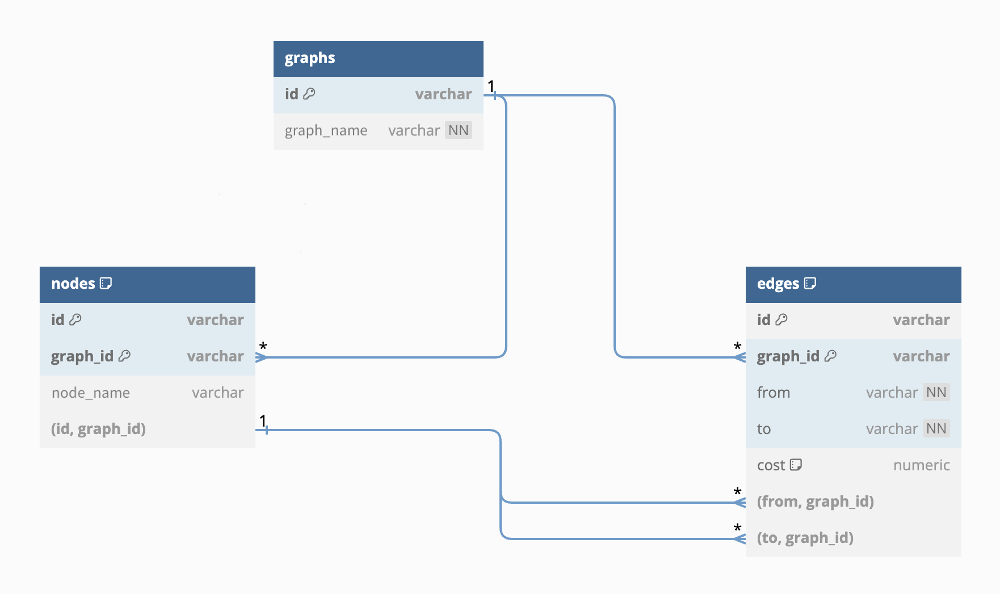

# Overview

# Setup Instructions

This project uses Golang version 1.20 and PostgreSQL version 15.6.

## Installation

1. Decompress the project files into a directory of your choosing.

2. Navigate to the root project directory (`parse-graph`).

3. Ensure that Go version 1.20 or later is [installed](https://go.dev/dl/) and currently in use in your environment. Run `go install`.

4. Ensure that PostgreSQL version 15.6 is [installed](https://www.postgresql.org/download/). To ensure that it's running, you may need the following command:
```bash
# On Linux
sudo service postgresql start

# On macOS with Homebrew
brew services start postgresql
```

## Database

1. Ensure you're logged in to PostgreSQL as a privileged user, and create a new database (e.g. `graph_data`). You can do this from the command line:
```bash
createdb graph_data
```
2. Set up the database schema and functions by reading in the commands from `data/graphs.sql`:
```bash
psql -d graph_data -f ./data/graphs.sql
```

## Environment

The application connects to the DB with the help of environment variables and the `github.com/joho/godotenv` package. In the project root, create a `.env` file, and populate it like so:
```
DB_HOST=localhost
DB_PORT=5432
DB_USER=<your_username>
DB_PW=<your_password>
DB_NAME=graph_data
```
Change the variables as needed for your local PostgreSQL configuration. If your chosen PostgreSQL user doesn't need a password, you can leave `DB_PW` empty.


# Implementation Notes

## XML Parsing

This project utilizes `github.com/beevik/etree` to parse XML inputs. `etree` is built on top of the standard library's `encoding/xml` package, and provides an easily traversable document-oriented model.

I began the project using the native `encoding/xml` package, a standard struct-based solution. Some sources warn that it doesn't perform the best for large or especially complex inputs, but large-scale graphs weren't a concern for this project, so it seemed suitable.

Once it came time to handle input validation, I reexamined other options just to see if any might be a little more ergonomic. The document-tree data model of the `etree` package made validating nested tags quite intuitive—akin to accessing objects in the browser DOM—and to my eyes, more readable than my original struct-based approach.

## SQL Schema

Here is an ERD to demonstrate how I set up the SQL schema for graphs:



The comments in `graphs.sql` provide further information on the relationships between these tables.

## JSON Parsing

## Path Algorithms

Upon first glance at the problem, my first instinct was to implement Dijkstra's algorithm on the application level. This would efficiently find cheapest paths, and with a memoization component, finding all paths could be a convenient byproduct. The only database query needed would be to load the graph data initially.

However, after I'd gotten the `find_graph_cycles` SQL procedure working, I realized this procedure could be modified to return all paths between two nodes. This isn't the most efficient or database-friendly approach, but I'll be honest: I was so happy to have managed this in SQL that I wanted to do it again. 🤓 

### All Paths from A to B

The task of finding all paths between two given nodes is accomplished in the `find_all_paths` PL/pgSQL function defined in `graphs.sql`.

The function returns the results of a recursive SQL query that uses a CTE (Common Table Expression) to keep track of paths between nodes in the graph. With the use of PostgreSQL's `CYCLE` syntax, it avoids falling into infinite cyclic loops. It also keeps track of which paths contain cycles with the boolean `is_cycle` column, making it easy to filter out cyclic paths for the results.

To make finding cheapest paths easier, this function also tracks and returns the total cost of each path.

### Cheapest Path from A to B

If we've already calculated all paths between two nodes, finding the cheapest path is easy: just choose the path with the minimum cost.

Since our inputs may contain both "all paths" and "cheapest" queries for the same pair of nodes, I decided to implement an ephemeral cache of sorts within the `handleJSON` function. For each query, we first check local memory to see if we've already loaded the results of `find_all_paths` for the given start and end nodes. If so, we don't need to bother the database again.


# Thoughts for Further Improvement

## Efficiency

My current approach is not very database-friendly. In the worst case, it executes a recursive function in the database for every query in the input list. For the current purposes, optimization was not a priority, but to scale well with increased input length, frequency, or graph complexity, we'd want to do things differently.

Here are two potential alternatives:

### Execute Queries As a Single Batch
Instead of handling each query one-by-one, we could prepare one large batch query:
1. Iterate once through the query list, keeping track of start-end node pairs in memory.
2. Instead of calling `find_all_paths` on one node pair at a time, call it once, returning results for all pairs.
3. Aggregate the results by the value of the start node, or by node pairs.

### Move Pathfinding to Application

As I mentioned before, Dijkstra's algorithm would work well here. (I've included a basic implementation in `paths.go`, but the application doesn't use it currently.) This would move the computational work to the application level. It may not be as efficient as database functions under the hood, but if we needed to scale horizontally down the line, it would be easier to replicate the application than to replicate the database.

## Caching

Another great way to increase efficiency would be to use a proper caching mechanism. I spent some time brainstorming and researching a few ways to do this, but for the sake of time decided not to implement them (yet).

## Project Layout